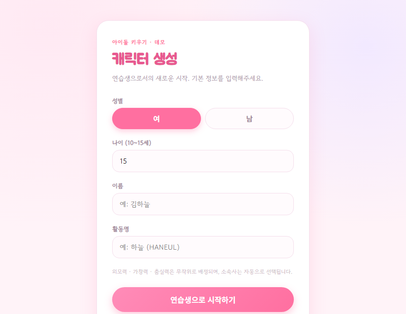
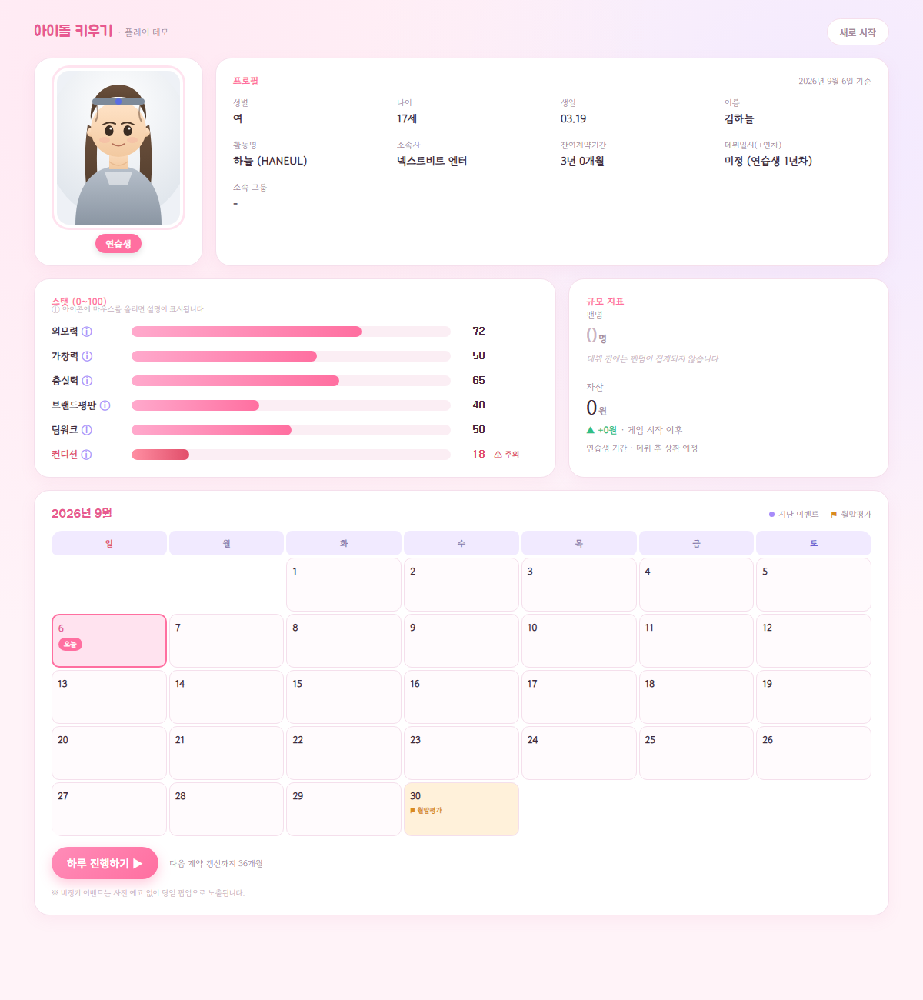

# 아이돌 키우기 (Idol Game) — 플레이 데모

연습생부터 데뷔, 전성기까지 나만의 아이돌을 키우는 라이프 시뮬레이션 게임의 초기 기획 데모입니다.
프레임워크나 빌드 과정 없이 순수 HTML/CSS/JavaScript로 만들어져 있어, `index.html`을 브라우저로 열거나
GitHub Pages를 통해 바로 플레이할 수 있습니다.

## 미리보기

| 캐릭터 생성 | 메인 대시보드 |
|---|---|
|  |  |

## 플레이 방법

1. `index.html`을 브라우저로 열거나, 배포된 GitHub Pages 링크에 접속합니다.
2. 성별 / 나이(10~15세, 범위를 벗어나면 오류 메시지가 뜹니다) / 이름 / 활동명을 입력해 연습생을 생성합니다. 외모력·가창력·춤실력은 무작위로 배정됩니다.
3. 캘린더의 **오늘** 칸(또는 "하루 진행하기" 버튼)을 클릭해 하루씩 진행합니다.
4. 특별한 일정이 없는 날은 "오늘의 활동"에서 연습할 스탯을 고르거나 휴식을 선택합니다.
5. 약 1주에 한 번꼴로 비정기 이벤트가 팝업으로 등장합니다. YES/NO, 또는 3지선다 중 하나를 선택하세요.
6. 컨디션이 20 미만이면 병가(감기·몸살) 확률이 올라가고, 0이 되면 그날은 강제로 앓아눕습니다.
7. 월말에는 연습생 신분일 때만 월말평가가 진행되며(매월 1일 합격 기준 사전 고지), 하위권이 2회 연속되면 방출됩니다.
8. 스탯이 충분히 오르면 "데뷔조 편성 제안" 이벤트가 등장할 수 있습니다. 수락하면 그룹명·멤버 수가 배정되며 데뷔합니다.
9. 데뷔 후에는 음악방송 출연(약 20일 주기)과 앨범 발매(약 60일 주기)가 팬덤·자산 성장의 주요 동력이 됩니다.
10. 지나간 날짜를 클릭하면 그날 무엇을 선택했고 실제로 어떤 결과가 나왔는지 다시 확인할 수 있습니다.
11. 종료 조건: 자산 -10억원 초과(파산), 만 40세 도달(은퇴), 26세까지 데뷔 실패 중 하나에 해당하면 게임이 종료됩니다.

진행 상황은 브라우저의 `localStorage`에 자동 저장되며, 상단의 "새로 시작" 버튼으로 언제든 초기화할 수 있습니다.

## 구현된 기획 요소

- **프로필**: 성별 / 나이 / 생일 / 이름 / 활동명 / 소속사 / 잔여계약기간 / 데뷔일시(+연차) / 소속 그룹(+멤버 수)
- **스탯**: 0~100 상한 스탯(외모력·가창력·춤실력·브랜드평판·팀워크·컨디션)은 막대바로 표시되며, 20 미만이면 빨간 경고색으로 강조됩니다. 라벨의 ⓘ 아이콘에 마우스를 올리면 설명이 표시됩니다.
- **팬덤 · 자산**: 상한이 없는 지표로, 숫자와 최근 추세(▲▼)로 표시됩니다. 연습생 단계에서는 팬덤이 아직 집계되지 않고, 데뷔 후에는 소소한 일일 수입(스트리밍 등)과 방송·앨범 활동을 통해 성장합니다.
- **캘린더**: 월말평가·계약만료처럼 확정된 일정만 사전에 표시되고, 비정기 이벤트는 예고 없이 당일 팝업으로 노출됩니다. 지나간 날짜를 클릭하면 그날의 선택과 실제 결과를 다시 볼 수 있습니다.
- **이벤트 3종**: 확률성 리스크형(방향·등급 아이콘만 고지), 계약/투자형(실수치 표기), 다지선다형(3지선다 이상) — 시구 초청, 음악방송 출연, 앨범 발매 등 포함
- **건강 시스템**: 컨디션이 낮을수록 병가(감기·몸살) 확률 상승, 0이면 그날은 아무것도 할 수 없음
- **그룹 데뷔**: 데뷔 수락 시 가상 그룹명과 멤버 수(4~7인)가 배정되어 프로필에 표시됨
- **캐릭터 일러스트**: 연습생 / 데뷔 / 전성기 커리어 단계별로 자동 교체되는 정적 SVG 일러스트
- **성인 이벤트 게이트**: 음주·연애·운전·성형 등은 19세부터 등장

## 파일 구조

```
IdolGame/
├── index.html          캐릭터 생성 + 메인 게임 화면
├── css/style.css        전체 스타일
├── js/
│   ├── illustrations.js 캐릭터 일러스트 (SVG, 단계별)
│   ├── events.js        비정기 이벤트 풀 데이터
│   └── app.js            게임 상태·캘린더·모달·저장 로직
└── docs/                 README용 스크린샷
```

## 참고

이 데모는 기획 검토용 프로토타입입니다. 스탯 수치·이벤트 확률 등은 밸런스가 확정되지 않은 예시 값입니다.
